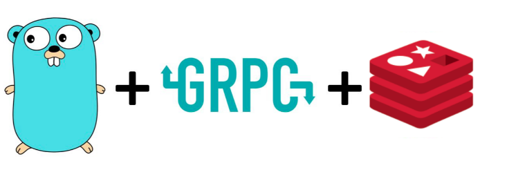

# gRPC Service
Microservice in golang, using Redis and gRPC



## Installing protobuffer

### Linux

```shell
    sudo apt install protobuf-compiler -y
```

## MacOS
```shell
    brew install protobuff
```


We want a microservice that handles the basic operations, SET, UPDATE and DELETE using Redis as a database and gRPC as communication architecture.
- Golang
- GRPC
- Docker
- Redis

### How to run
```html
docker-compose up
```
